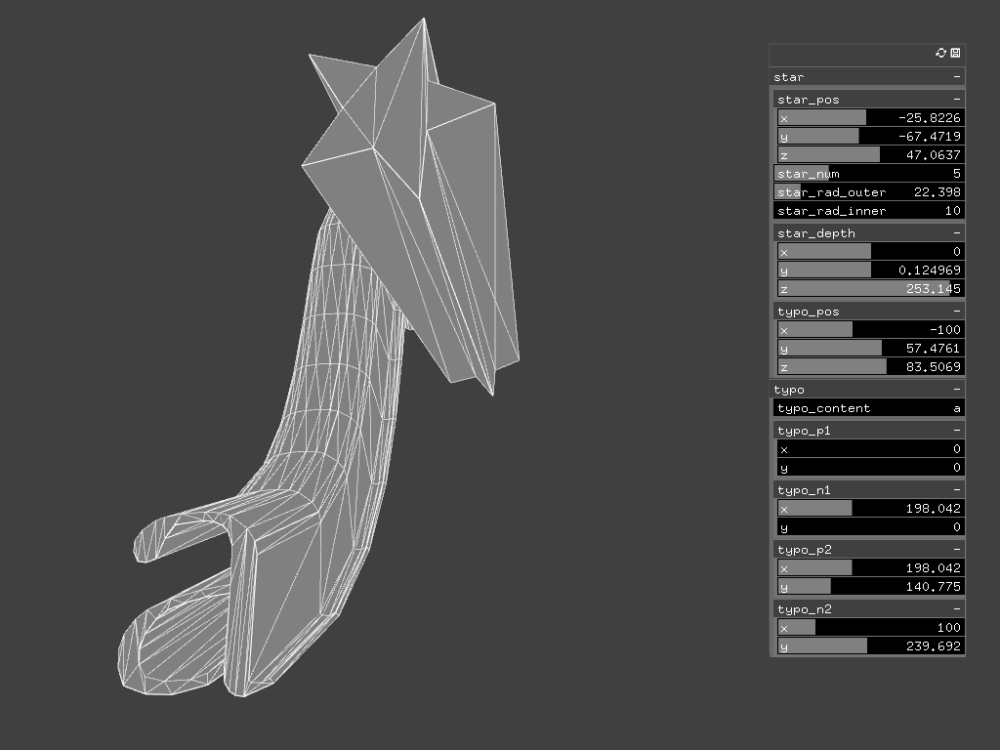

# ofxExtrude
openFrameworks addon for extruding ofPath into ofMesh  



## usage
* prepare `ofPath` to extrude
    * load from svg, font, dynamic shape etc...
* call `ofxExtrude::getByCurve` or `ofxExtrude::getByStraight`
    * specify vector or curve(ofPolyline) in the 2nd parameter

```C++
ofPath path;

ofVboMesh mesh1 = ofxExtrude::getByStraight(path, dir);
ofVboMesh mesh2 = ofxExtrude::getByCurve(path, curve);
```
## Reference
* [Extrude Text into 3D](https://forum.openframeworks.cc/t/extrude-text-into-3d/6938)
